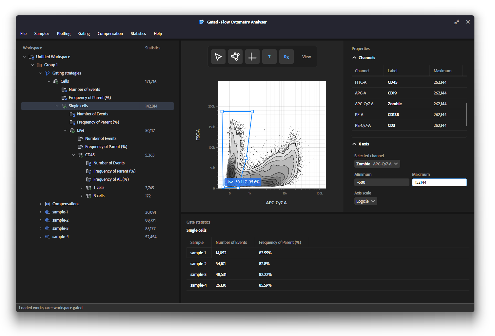

# Gated: Flow Cytometry Analyser

Gated is a free, light-weight and elegant analyser and visualizer of FCS data.
It is a cross-platform application with supports of:

- Management of FCS samples into groupings and workspace.
- Spillover compensation
- Hierarchial gating
- Common statistical analysis of sub-populations
- Plotting and visual style customization
- Embedded data package format for reproducible analysis and sharing

### Licensing

Gated is licensed under GNU GPLv3. This program is distributed in the hope that it will be useful, but without any warranty; without even the implied warranty of merchantability or fitness for a particular purpose. See the GNU General Public License for more details. 

Copyright (C) Zheng Yang 2025 - 2026.