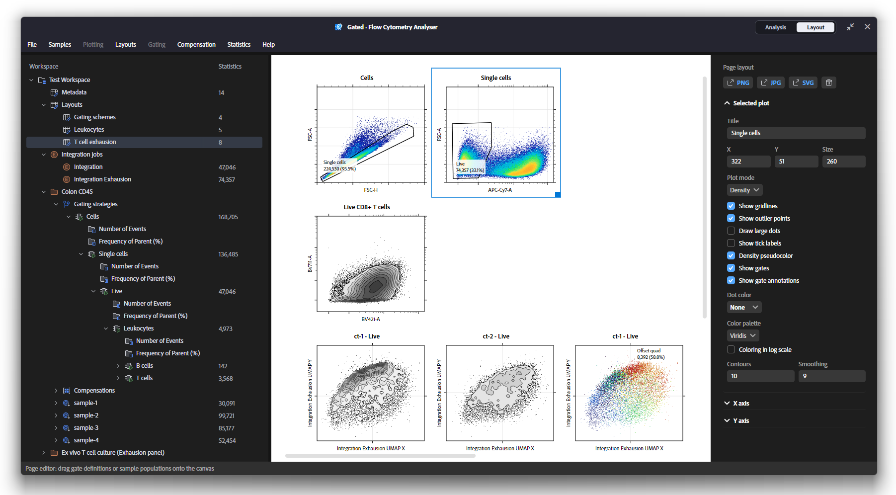
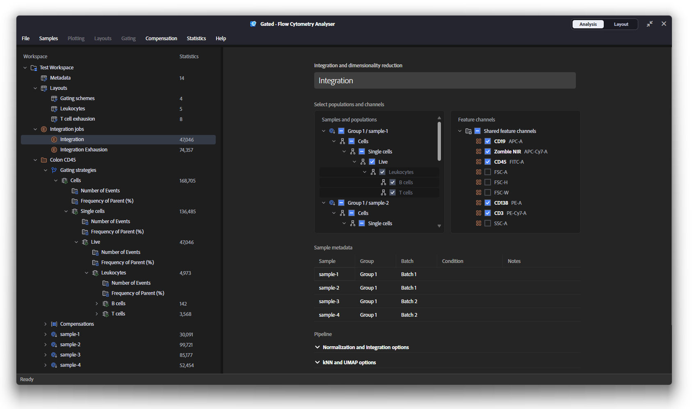

#  Gated: Flow Cytometry Analyser

Gated is a free, light-weight and elegant analyser and visualizer of FCS data.
It is a cross-platform application with supports of:

- Management of FCS samples into groupings and workspace.
- Spillover compensation
- Hierarchial gating
- Common statistical analysis of sub-populations
- Plotting and visual style customization
- Data normalization, integration and dimensionality reduction built-in
- Layout editor for graphics export
- Embedded data package format for reproducible analysis and sharing

### Installation

See the releases for compiled binary packages for **Windows x64 (.Net 10)**
[Download Releases](https://github.com/yang-z-03/gated/releases)

This is the portable software package that you could decompress anywhere without
administrator previlege and run the application. The software will try to update
itself if newer versions are released if there are network connection from the GitHub
repository releases.

### Screenshots

Population hierarchy

Layout editor

Data normalization and integration

### Licensing

Gated is licensed under GNU GPLv3. This program is distributed in the hope that it will be useful, but without any warranty; without even the implied warranty of merchantability or fitness for a particular purpose. See the GNU General Public License for more details. 

Copyright (C) Zheng Yang 2025 - 2026.